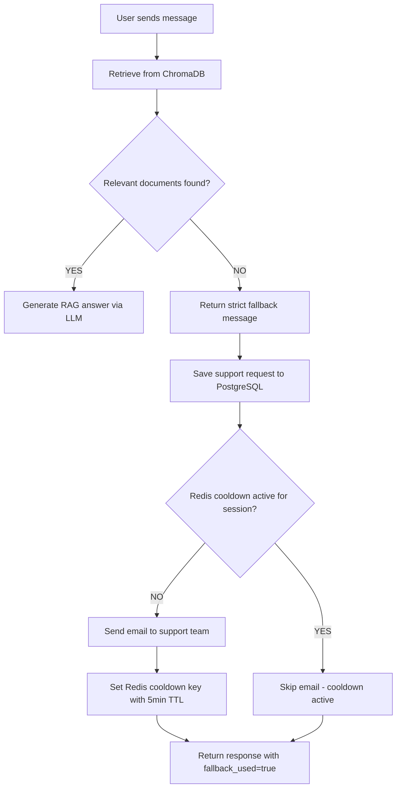

# Human Support Flow

## Purpose

When the chatbot cannot find a relevant answer in the knowledge base, the system enforces a strict fallback - no LLM-generated answers are allowed. The fallback triggers a full escalation workflow: save to PostgreSQL, check Redis cooldown, and send email notification to the support team.

---

## Architecture

| Component | Role |
|-----------|------|
| **PostgreSQL** | Permanent storage for support requests (source of truth) |
| **Redis** | Temporary cooldown to prevent email spam (TTL-based) |
| **Email** | One-time notification to support team |
| **LLM** | NOT used during fallback - completely skipped |

---

## Backend Flow



---

## Fallback Response

The system returns a predefined message in the user's detected language. Example in English:

> "I couldn't find a relevant answer to your question. Your enquiry will be assigned to our support team. Please be patient while we assist you."

This message is translated for all 10 supported languages: en, es, ar, fr, zh, pt, de, ja, ko, hi

---

## PostgreSQL: support_requests Table

Each fallback case creates a permanent record:

| Column | Type | Description |
|--------|------|-------------|
| id | SERIAL PRIMARY KEY | Auto-increment ID |
| session_id | VARCHAR | User session identifier |
| user_message | TEXT | The user's original question |
| fallback_message | TEXT | The fallback response sent |
| language | VARCHAR(10) | Detected language code |
| status | VARCHAR(20) | Default: `pending` |
| email_sent | BOOLEAN | Whether notification email was sent |
| chat_summary | TEXT | Recent chat context (optional) |
| created_at | TIMESTAMP | Record creation time |

---

## Redis Cooldown Logic

To prevent email spam from the same session:

1. Key format: `support_email_sent:{session_id}`
2. TTL: 300 seconds (5 minutes) - configurable via `SUPPORT_EMAIL_COOLDOWN`
3. Before sending email, check if this key exists
4. If key exists -> skip email, mark `email_sent=false`
5. If key does not exist -> send email, set key with TTL, mark `email_sent=true`

---

## Email Notification

When cooldown is not active, the system sends an HTML email to the configured `SUPPORT_EMAIL`:

**Subject:** `[Getmee Support] New enquiry from session {session_id}`

**Body includes:**
- Session ID
- User language
- User's original message
- Recent chat summary (if available)
- Note that chatbot could not find a relevant answer

---

## Frontend Integration

When the API returns `fallback_used: true`, the frontend should show support options:

```javascript
if (response.fallback_used) {
  showSupportOptions = true;
}
```

### React UI Example

```jsx
{response.fallback_used && (
  <div className="support-box">
    <p>I couldn't find this information. Do you need help from a support agent?</p>

    <button onClick={handleSupportYes}>
      Yes, contact support
    </button>

    <button onClick={handleSupportNo}>
      No, I'll try again
    </button>
  </div>
)}
```

### Button Handlers

**YES - Support:**
```javascript
const handleSupportYes = () => {
  setMessages(prev => [
    ...prev,
    {
      role: "bot",
      text: "Your enquiry has been forwarded to our support team. We'll get back to you shortly."
    }
  ]);
};
```

**NO - Continue Chat:**
```javascript
const handleSupportNo = () => {
  setMessages(prev => [
    ...prev,
    {
      role: "bot",
      text: "Sure, please try asking your question differently."
    }
  ]);
};
```

---

## Key Rules

- **No hallucination**: LLM is never called when no relevant documents are found
- **PostgreSQL is the source of truth** for all support request records
- **Redis is temporary only**: cooldowns and session data (not permanent storage)
- **Email is notification only**: not the primary record of support requests
- **fallback_used = true** is always set in the API response for fallback cases
- Support request is saved in PostgreSQL BEFORE attempting email notification
- Email failure does not block the fallback response to the user

---