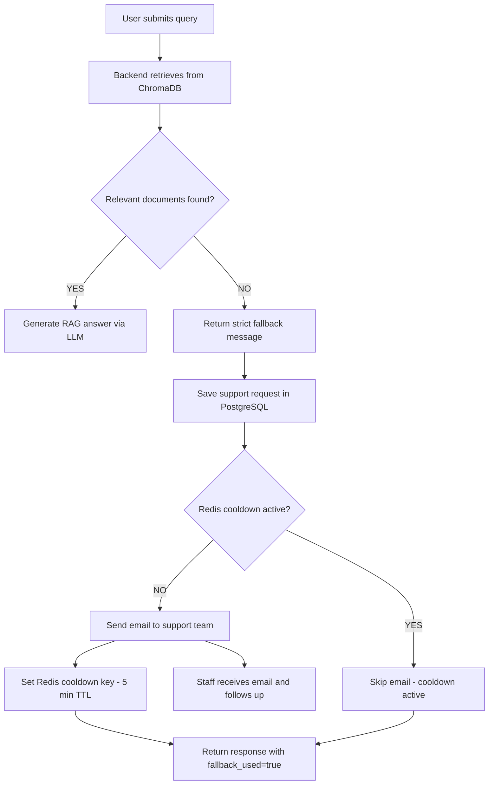
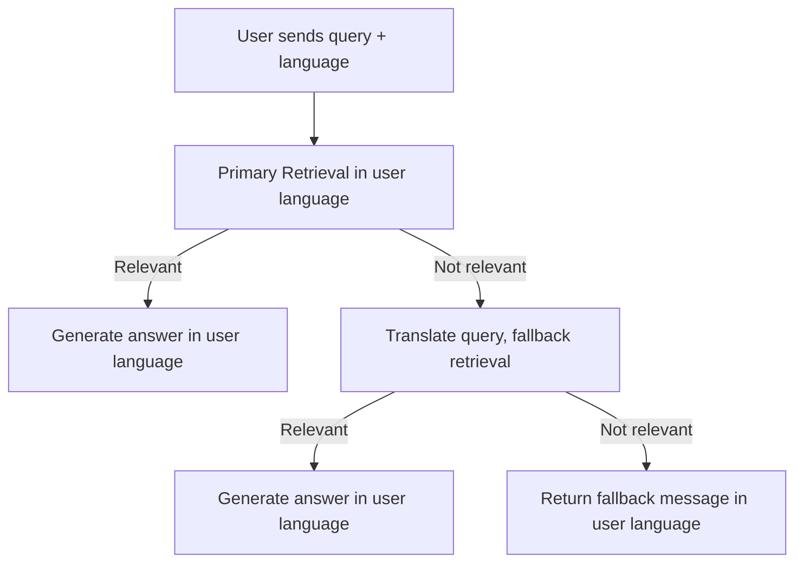

# GetMee Chatbot System Overview

This document provides a high-level overview of the GetMee Chatbot backend workflow, Retrieval-Augmented Generation (RAG) flow, email escalation, and user rating/feedback system. It is designed for technical leads to present the architecture and escalation logic.

---

## 1. Overall Workflow

1. **User submits a query** via the frontend.
2. **Backend processes the query**:
   - Retrieves relevant documents from ChromaDB (vector database).
   - If relevant context is found, generates an answer using LLM (RAG flow).
   - If no relevant context is found, triggers a strict fallback (no LLM answer).
3. **Response is returned** to the user, with metadata indicating if fallback/escalation was used.

---

## 2. RAG (Retrieval-Augmented Generation) Flow

- **Primary Retrieval**: 
  - Search ChromaDB using the user's query and language.
  - If relevant documents are found (distance < threshold), build a prompt and generate an answer in the user's language.
- **Multilingual Fallback**:
  - If no results in the original language, translate the query and retry retrieval in a fallback language (e.g., English/Spanish).
  - If still no results, return a safe fallback message in the user's language (no LLM answer).
- **Key Rules**:
  - The final answer is always in the user's selected language.
  - Retrieval can use cross-language context, but the answer must not mix languages.

---

## 3. Email Escalation (Human Support Fallback)

- If the system cannot answer a query (no relevant context in ChromaDB):
  1. Returns a strict fallback message to the user.
  2. Saves a support request in PostgreSQL (with session, message, language, etc.).
  3. Checks Redis for a cooldown (to avoid spamming support).
  4. If no cooldown, sends an email notification to the support team and sets a 5-minute cooldown in Redis.
  5. Staff receives the email and follows up with the user.

**Data Flow:**
- **Redis**: Temporary session memory, cooldown flags.
- **PostgreSQL**: Permanent storage for support requests, chat logs, feedback.
- **Email**: One-time notification to staff.

---

## 4. User Rating & Feedback System

- **Message-level Feedback**:
  - After each bot answer, users can rate as "Satisfied" or "Not Satisfied".
  - If "Not Satisfied", the UI offers options to try again or contact support (escalation).
  - Feedback is stored in PostgreSQL and updates session state in Redis.

- **Session-level Rating**:
  - At the end of the chat, users can rate the whole conversation (1–5 stars) and leave a comment.
  - Ratings and comments are stored for analytics and quality improvement.

---

## 5. Summary Diagrams

### Escalation to Human Support

### Multilingual RAG Flow

---

## 6. Chatbot Message Handling Flow (2026 Update)

The chatbot now follows a strict, user-friendly message handling order to avoid unnecessary fallback/escalation and improve conversational UX:

**PROCESS ORDER:**
1. **Small-talk/Low-Intent Detection**
   - Examples: "hi", "ok", "hm", "thanks", "bye"
   - → Reply: “I’m here if you need help.” (No RAG, no fallback, no escalation)
2. **Context Update Detection**
   - Examples: "my name is Alex", "I am Alex"
  - → Extract and store name in Redis (user_name), reply: “Nice to meet you, Alex! How can I help you today?” (No RAG, no fallback)
3. **Session Context Question**
   - Example: "what is my name?"
   - → Read from Redis. If found: “Your name is [stored_name].” If not: “I don’t have your name yet.” (No RAG, no fallback)
4. **RAG (ChromaDB) Retrieval**
   - Only for real knowledge-base questions (e.g., “how to register?”)
5. **Fallback/Escalation**
   - Only if all above fail (never for small-talk, context update, or context-based answers)

**Key Rules:**
- Never escalate or fallback for small-talk, context updates, or context-based answers.
- Always check Redis session context before RAG.
- Only escalate if no answer is possible from context or RAG.

This flow ensures a more natural, helpful, and non-intrusive chatbot experience for users.

---

For more details, see the backend/docs/ directory and code comments in the feedback and support modules.
