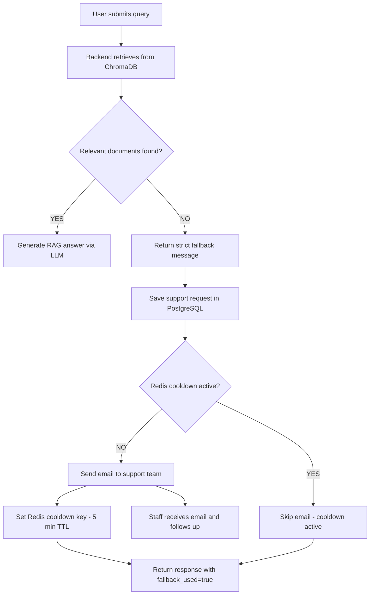
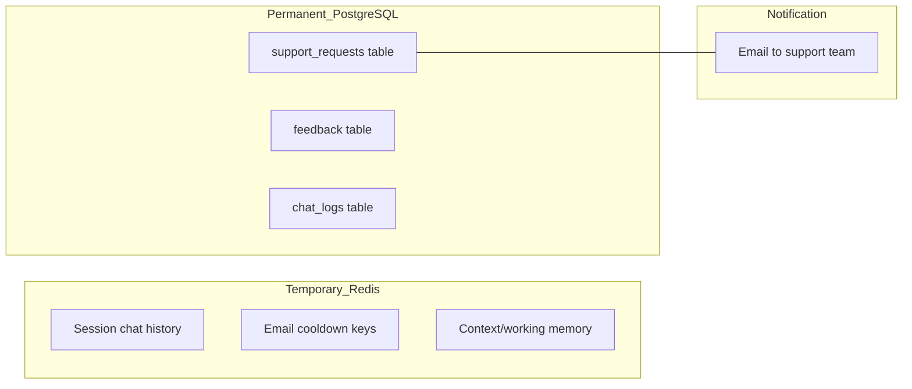
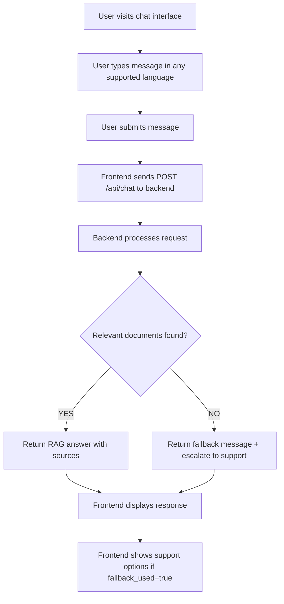
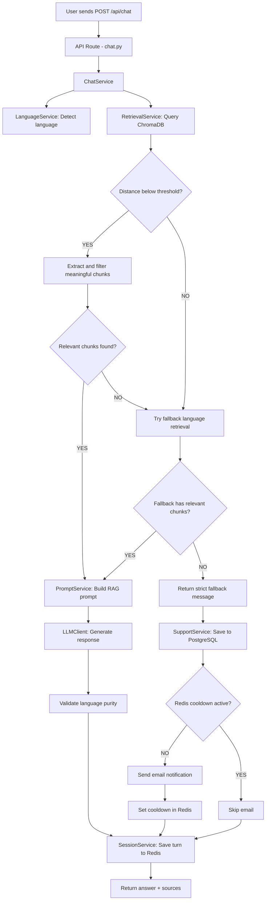
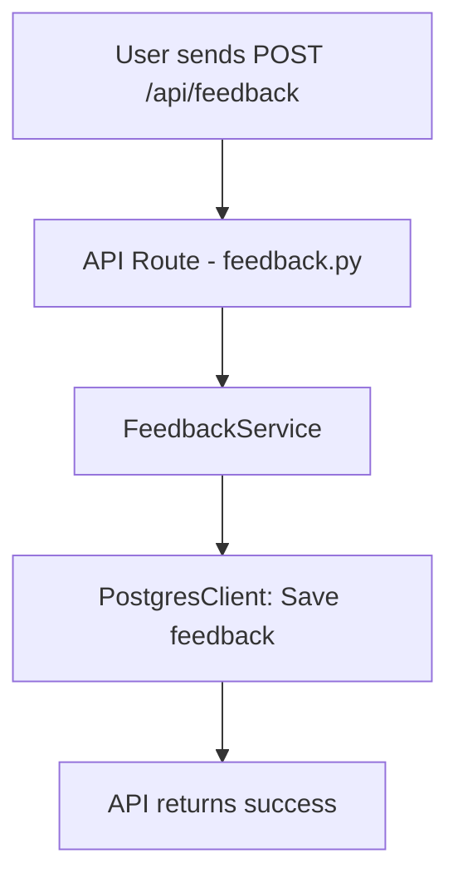
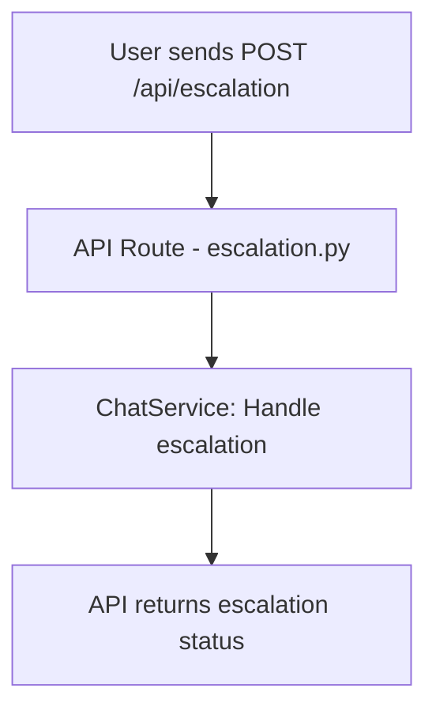
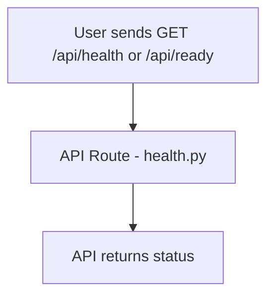

# GetMee Chatbot Backend - System Flow

## Escalation to Human Support (Fallback)

When the knowledge base cannot find relevant information for a user query, the backend enforces a **strict fallback** - no LLM-generated answers are allowed. Instead, the system saves a support request in PostgreSQL, checks Redis cooldown, and sends an email notification to staff.

### Fallback Escalation Flow

### Data Storage Architecture

| Component | Purpose | Data Lifetime |
|-----------|---------|---------------|
| Redis | Session memory, cooldown flags | Temporary (TTL-based) |
| PostgreSQL | Support requests, feedback, logs | Permanent |
| Email | Staff notification | One-time trigger |

### PostgreSQL support_requests Table

| Column | Type | Description |
|--------|------|-------------|
| id | SERIAL PRIMARY KEY | Auto-increment ID |
| session_id | VARCHAR | User session identifier |
| user_message | TEXT | The user's original question |
| fallback_message | TEXT | The fallback response returned |
| language | VARCHAR(10) | Detected language code |
| status | VARCHAR(20) | Request status (default: pending) |
| email_sent | BOOLEAN | Whether email notification was sent |
| chat_summary | TEXT | Recent chat context (nullable) |
| created_at | TIMESTAMP | When the request was created |

---

## User Flow

---

## Chat Request Flow (Detailed)

---

## Feedback Flow

## Escalation Flow

## Health Check Flow

---

## Supported Languages

The system supports 10 languages with auto-detection and translated fallback messages:

en, es, ar, fr, zh, pt, de, ja, ko, hi

---

- All services are modular and can be extended or replaced.
- ChromaDB, Redis, and PostgreSQL integrations are abstracted for easy upgrades.
- Language detection and prompt building ensure correct language output.
- **Strict fallback policy**: the LLM is never called when no relevant documents are found.
- **PostgreSQL is the source of truth** for all support request records.
- **Redis handles only temporary data**: sessions, cooldowns, working memory.