# GetMee Chatbot Frontend - System Flow

## Overview

This document describes the user-facing flows in the frontend chatbot application and how they connect to the FastAPI backend.

---

## 1. Application Bootstrap Flow

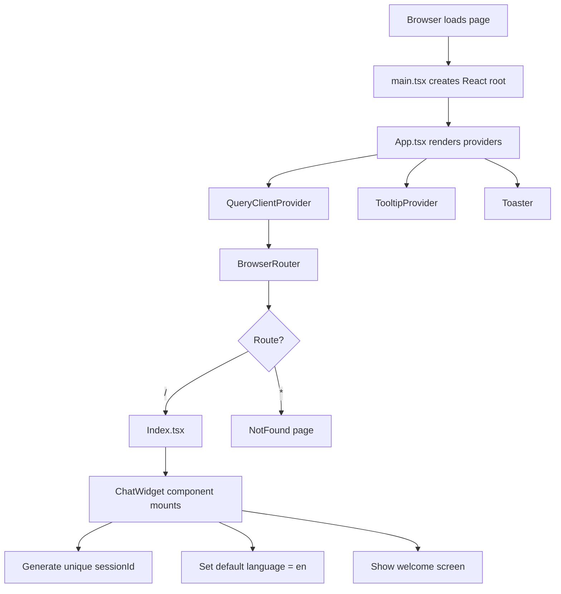

---

## 2. Chat Message Flow

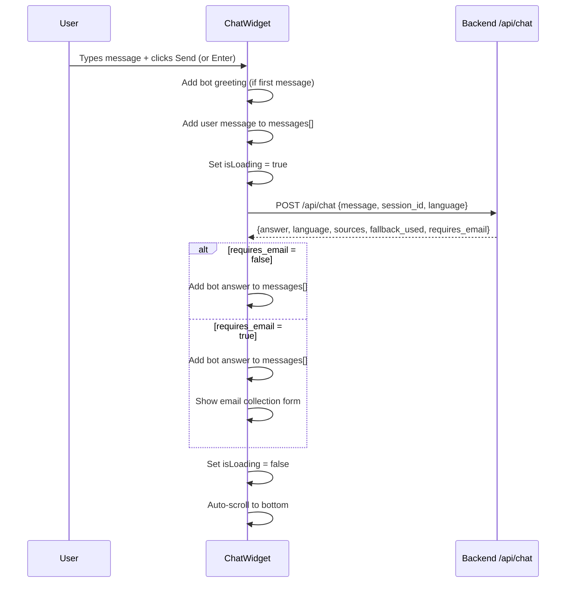

### Chat Request Payload

```json
{
  "message": "How does AI scoring work?",
  "session_id": "session_1711468800_abc1234",
  "language": "en"
}
```

### Chat Response Payload

```json
{
  "answer": "AI scoring uses natural language processing to...",
  "language": "en",
  "sources": ["document1.pdf"],
  "fallback_used": false,
  "requires_email": false
}
```

---

## 3. Quick Question Flow

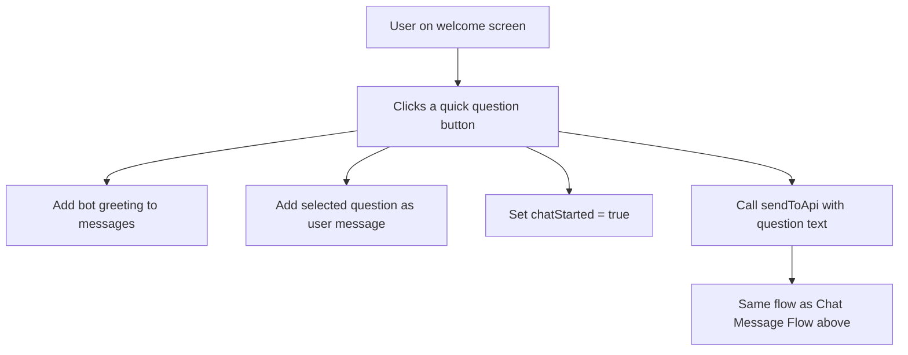

Quick questions are defined per language in the `translations` object — 5 for English, 5 for Spanish. They change instantly when the user toggles language before starting a chat.

---

## 4. Language Toggle Flow

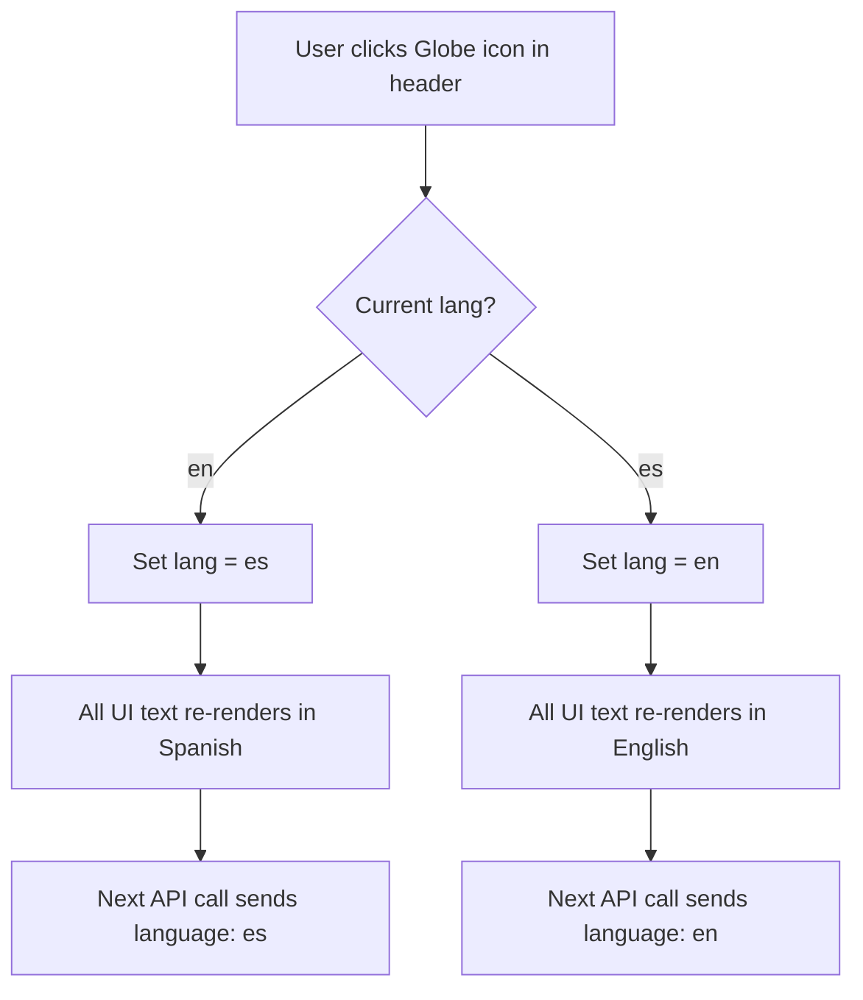

### Key Behavior

- Language toggle is **always available** in the header
- Switching language updates **all visible UI text** immediately (welcome screen, placeholders, buttons)
- The `language` field is sent with every `/api/chat` and `/api/support` request
- Chat history messages are **not re-translated** — only new messages use the new language
- Backend responds in the language specified in the request

---

## 5. Email Collection / Escalation Flow

When the backend cannot find relevant information in the knowledge base, it returns `requires_email: true`. The frontend then collects the user's email to escalate to human support.

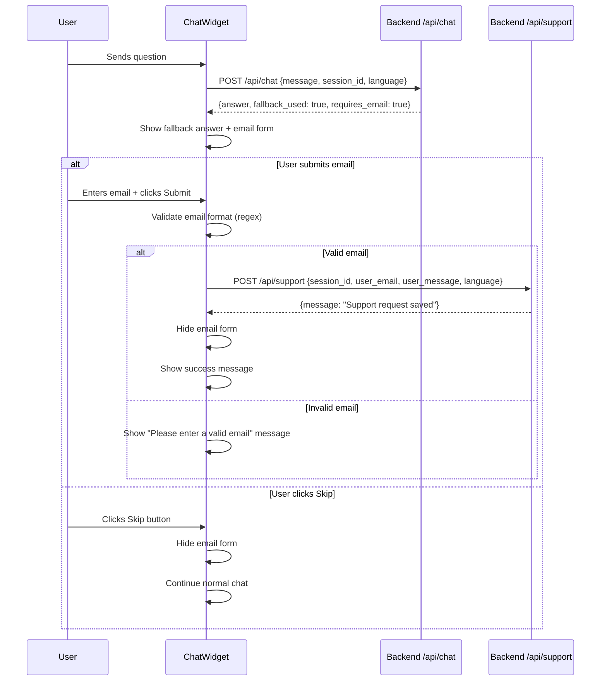

### Support Request Payload

```json
{
  "session_id": "session_1711468800_abc1234",
  "user_email": "user@example.com",
  "user_message": "How do I reset my password?",
  "language": "en"
}
```

---

## 6. New Chat Flow

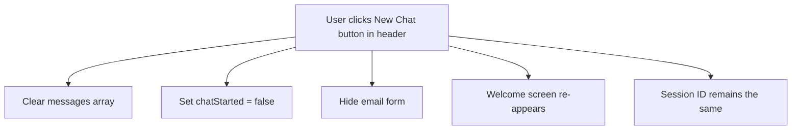

---

## 7. Widget Embedding Flow

This flow describes how the widget loader (`getmee-chatbot.js`) works when embedded on an external website.

### Floating Mode

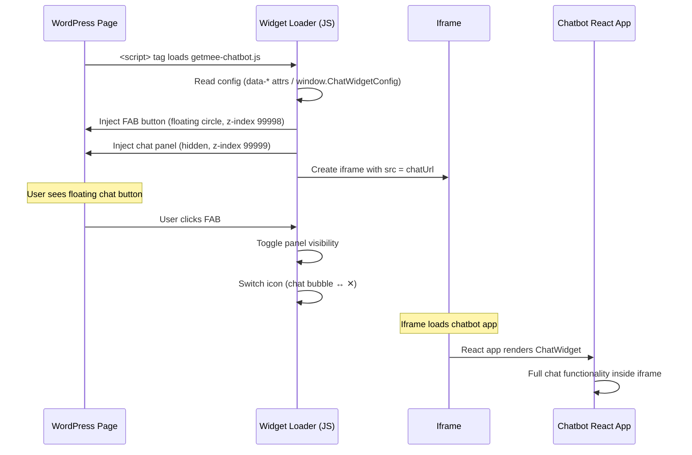

### Inline Mode

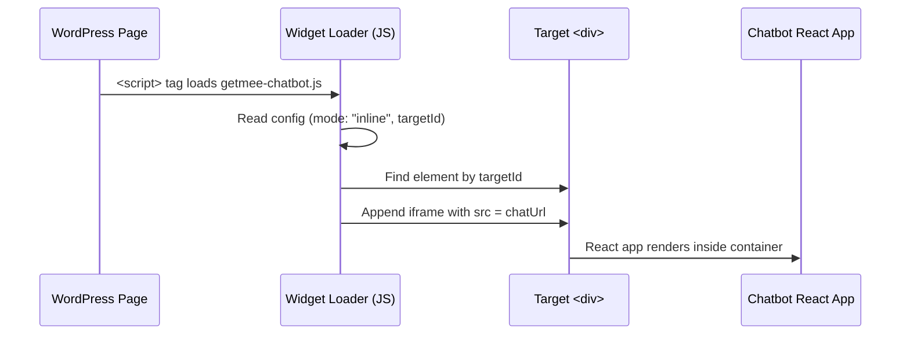

### Config Resolution

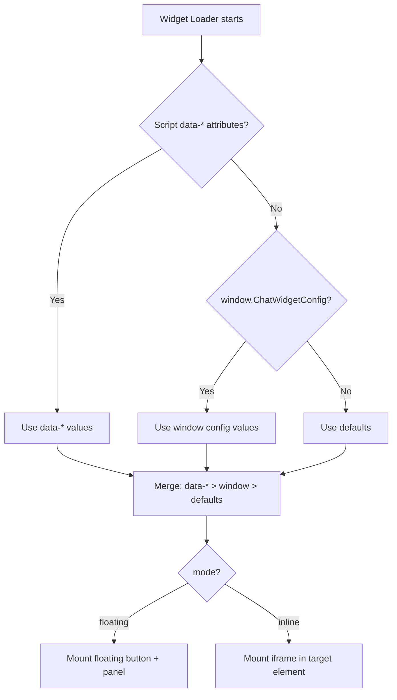

---

## 8. Error Handling Flow

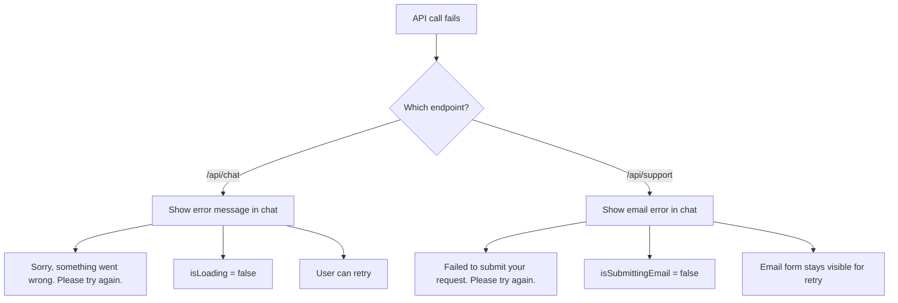

All error messages are fully translated (English and Spanish) and displayed as bot messages in the chat.

---

## 9. Complete User Journey

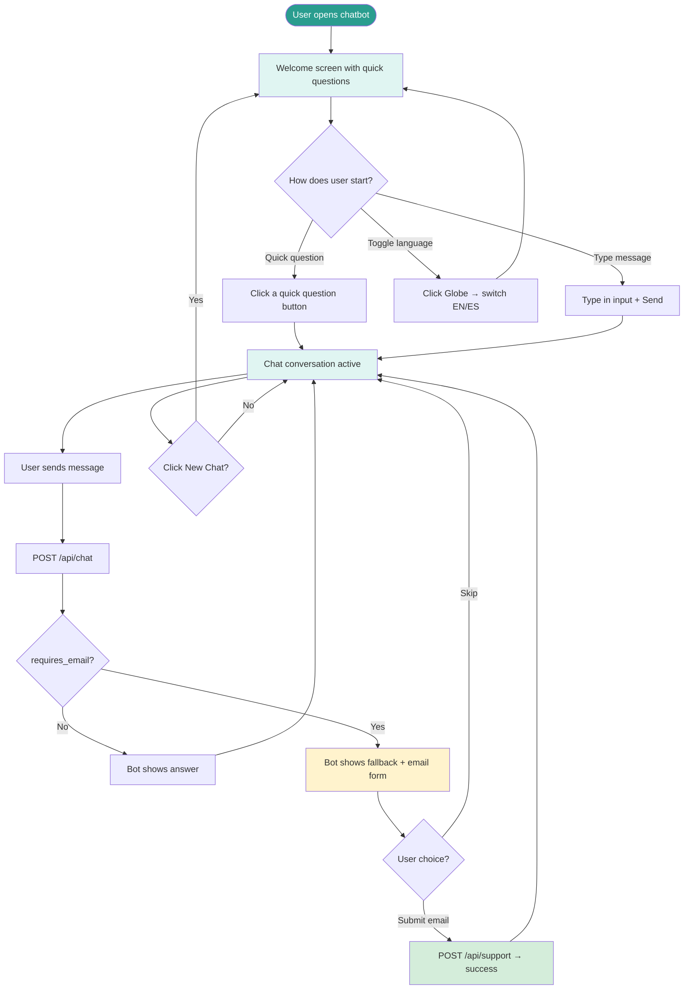
